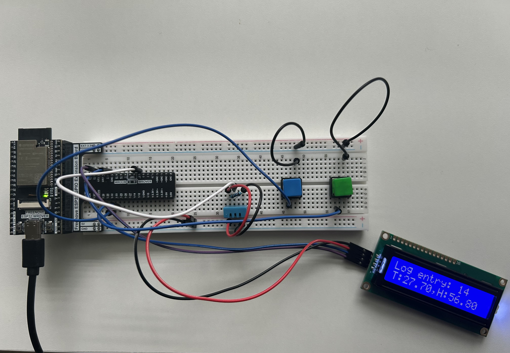

# Smart Environment Dashboard

## Overview
This project concludes Phase 2 of my Embedded Systems learning roadmap. It demonstrates sensor interfacing, SD card data logging, I2C LCD display handling, and user interaction via buttons on the ESP32 platform.

## Hardware Used
| Component | Description |
|---|---|
| **ESP32 Dev Kit** | Main microcontroller board |
| **DHT11 Sensor** | Measures temperature and humidity |
| **MicroSD Card** | Stores log entries persistently |
| **16x2 I2C LCD** | Displays log entries |
| **Push buttons** | Scroll through log entries on the LCD |
| **Breadboard, jumpers** | Circuitry |

# Visuals

### Circuitry


### Live Demo

[](https://www.youtube.com/watch?v=qR6wuf3IQvo&ab_channel=Agraw)

# Code & Output Sample

### Code
```c
// read temp and humidity
float temp = dht.readTemperature();
float hum = dht.readHumidity();

lcd.print("Log entry: " + String(displayIndex + 1)); // display log entry
```

### Serial Monitor
```txt
Logged: T:25.0,H:61.3
Logged: T:24.8,H:60.9
```
# Features

- The DHT11 sensor reads temperarure and humidity every 3 seconds
- These readings are written to an SD card as CSV-formatted strings
- Each reading is stored in memory and displayed on a 16x2 I2C LCD
- Users can scroll through the entries with buttons to view previous or next entries
- When the user scrolls, auto-scroll pauses to preserve their view.
- Scrolling down to the latest entry resumes the auto-scroll feature
