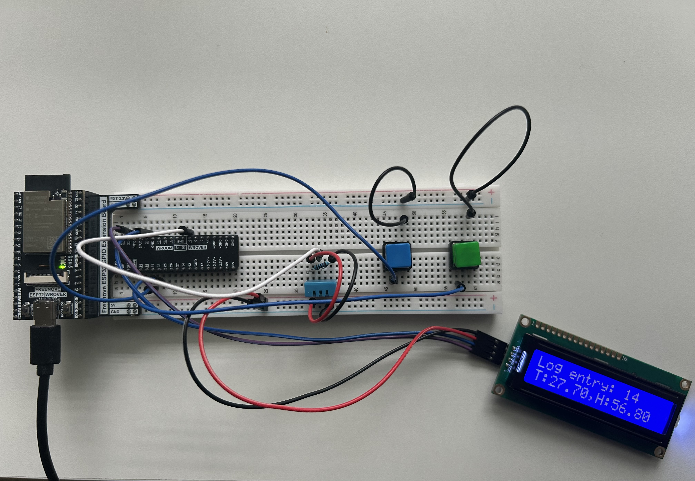

# Smart Environment Dashboard

ESP32-based embedded firmware system for temperature and humidity monitoring, persistent SD card logging, and local user interaction through an I2C LCD and physical buttons.

## Overview

This project demonstrates a modular embedded monitoring system built on the ESP32. The firmware periodically samples environmental data, logs readings to a microSD card, and displays both live and historical entries on a 16x2 LCD.

The system supports real-time user interaction through physical buttons, allowing manual navigation through stored log entries without disrupting background sampling and logging behavior.

## Features

- Periodic temperature and humidity sampling
- Persistent logging to microSD card
- 16x2 I2C LCD for real-time feedback
- Button-based navigation through historical log entries
- Auto-follow mode for latest data with manual user override
- Modular firmware structure for maintainability and future expansion

### Hardware

- ESP32
- DHT11 temperature and humidity sensor
- microSD card module
- 16x2 I2C LCD
- Push buttons for navigation

## Communication Interfaces

- **I2C**: LCD interface
- **SPI**: microSD card logging
- **GPIO**: button inputs

## System Architecture

The firmware is organized into the following layers:

- **Sensor layer**: acquires temperature and humidity data
- **Storage layer**: writes formatted log entries to SD card
- **UI layer**: updates LCD output and handles user navigation
- **Application logic**: coordinates periodic sampling, logging, and display state

## Control Logic

### Auto-follow behavior
By default, the LCD shows the latest log entry as new data is recorded.

### Manual override
When the user scrolls through historical entries:
- auto-follow pauses
- the selected log entry remains on screen
- returning to the newest entry resumes automatic updates

This logic was designed to preserve UI stability during concurrent background logging and user interaction.

## Key Embedded Concepts

- Non-blocking firmware design
- Cooperative task scheduling using timing intervals
- State-based input and UI handling
- SPI-based SD card data logging
- I2C peripheral interfacing (LCD)
- Modular firmware architecture

## Repository Structure

```text
include/   header files
lib/       reusable modules
src/       application source
test/      test scaffolding
platformio.ini
```

## Visuals & Demo

### Circuitry
- ESP32 connected to DHT11 sensor, microSD module (SPI), I2C LCD, and navigation buttons



### Live Demo

[](https://www.youtube.com/watch?v=qR6wuf3IQvo&ab_channel=Agraw)

## Future Improvements

- Add RTC or NTP timestamping
- Add SD card error detection and recovery
- Migrate periodic tasks to FreeRTOS
- Implement closed-loop temperature control
- Optimize power consumption for long-term deployment
